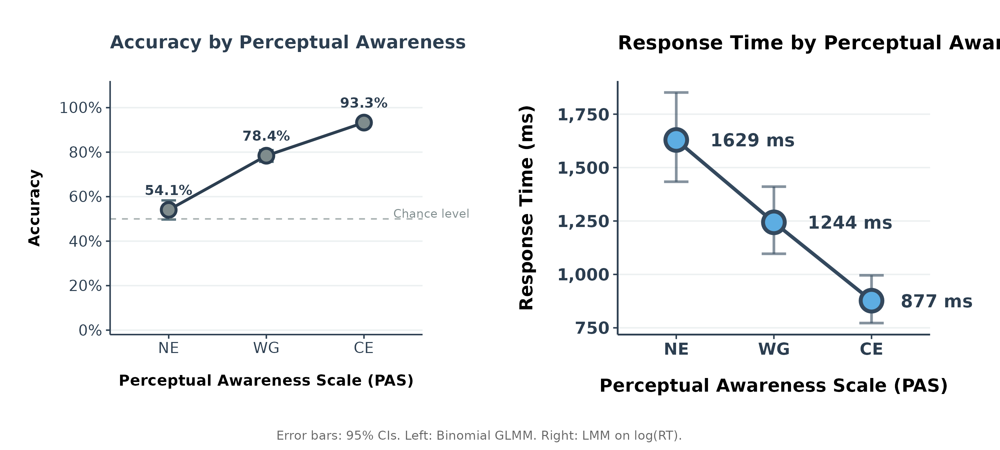
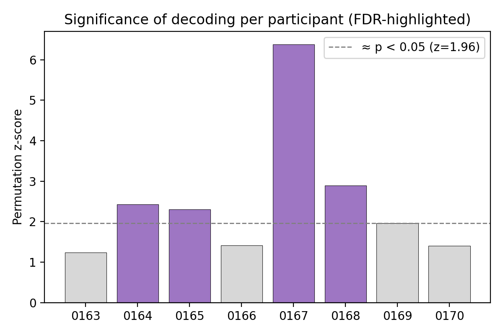
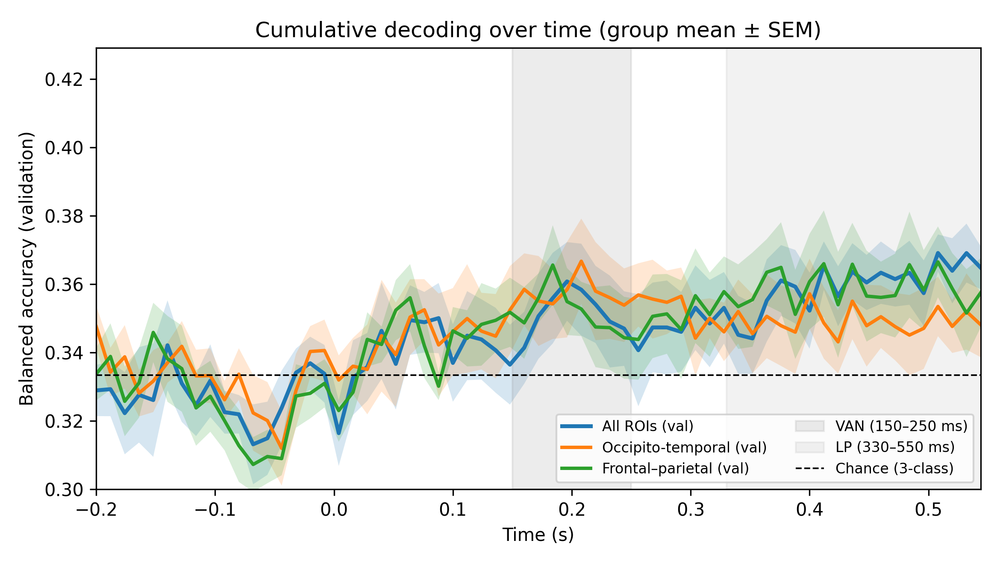
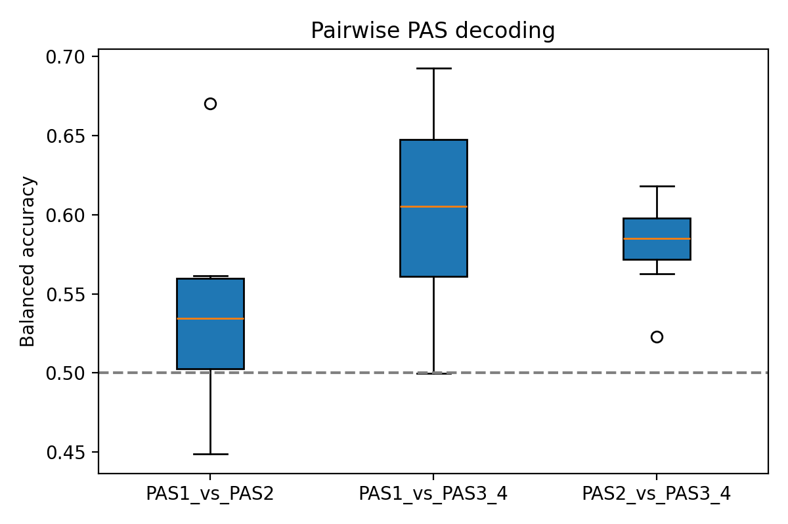
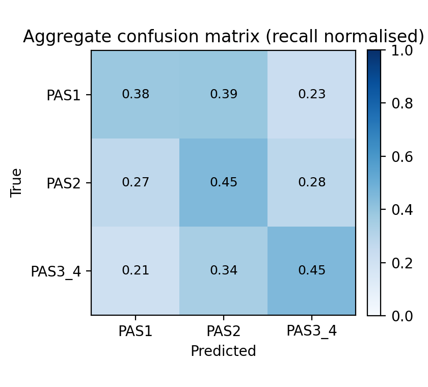
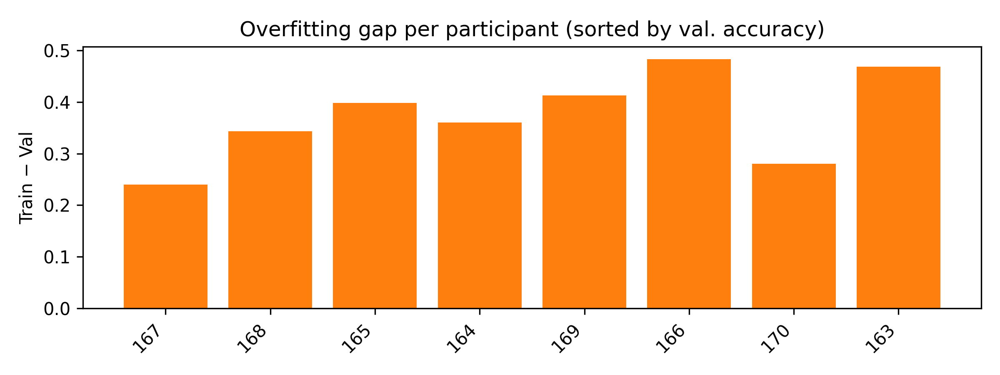

# MEG Study: Neural Correlates of Visual Consciousness

Advanced Cognitive Neuroscience portfolio exam investigating early vs late neural correlates of visual consciousness using MEG.

## What We Did

We ran an MEG experiment with 8 participants (3200 trials total) to figure out when consciousness "happens" in the brain. Participants viewed brief visual stimuli and rated their awareness using the Perceptual Awareness Scale (PAS). We then decoded brain activity during two critical time windows: the Visual Awareness Negativity (VAN, 150-250ms) and Late Positivity (LP, 330-550ms).

**Main finding:** Late activity (330-550ms) in fronto-parietal and occipito-temporal regions showed stronger discriminative signals than early activity (150-250ms), though the effects were modest. This suggests consciousness emerges gradually rather than at a single early moment.

## Behavioural Results

| PAS Level | Accuracy | Mean RT (ms) |
|-----------|----------|--------------|
| 1 (No Experience) | 54.1% | 1629 |
| 2 (Weak Glimpse) | 78.4% | 1244 |
| 3-4 (Clear Experience) | 93.3% | 877 |

Participants were more accurate and faster when they reported clearer awareness, confirming that subjective ratings tracked objective performance.

## Key Figures

### Behavioural Performance


*Additional behavioural figures: `fig_RT_by_PAS.png`, `fig_accuracy_by_PAS.png`, `fig_pas_distribution_3levels.png`, `fig_pas_distribution_4levels.png` in `figures/behavioural/`*

### MEG Decoding Results

**Per-participant validation accuracy:**


**Time-resolved decoding across the trial:**


**Pairwise classification between PAS levels:**


**Confusion matrix for multinomial model:**


**Model overfitting analysis:**


## Methods Summary

### Preprocessing Pipeline
Preprocessing steps are detailed in `nbs/multi_participant_preprocessing-studygroup2.ipynb`:

1. **Maxwell filtering and artifact removal**
   - Bad channels: 6 total (mean 0.75±1.75 per participant)
   - Only 2 participants had bad channels (0164: 1 channel, 0170: 5 channels)

2. **ICA decomposition**
   - 48 components removed total across all participants
   - Mean 6.13±1.96 components per participant
   - EOG correlation threshold ~0.9, ECG threshold ~0.25

3. **Epoch rejection**
   - 30 epochs rejected (0.93% rejection rate)
   - Automatic rejection based on peak-to-peak amplitude

4. **PAS collapsing**
   - Combined PAS3 and PAS4 into single "Clear Experience" category
   - Some participants had <10 trials at PAS4 level

### Source Reconstruction
We transformed sensor-space MEG data to source space using:

- **Anatomy:** FreeSurfer reconstruction with oct6 spacing (~4100 vertices per hemisphere)
- **Forward model:** Single-layer BEM (inner skull surface)
- **Inverse solution:** Dynamic Statistical Parametric Mapping (dSPM) with λ²=1/9
- **Baseline:** -200 to 0 ms relative to stimulus onset
- **ROIs:** ~68 cortical labels per hemisphere from Desikan-Killiany atlas

### Decoding Models

We tested three models to compare early vs late neural correlates of consciousness:

**Model 1: Multinomial Logistic Regression**
- Features: Mean dSPM values in VAN (150-250ms) and LP (330-550ms) windows
- ~136 features total (68 ROIs × 2 windows)
- Validation accuracy: 0.40 vs chance 0.33
- One-sample t-test: t(7)=4.38, p=.003
- Clear above-chance decoding, but modest effect size

**Model 2: Pairwise Classification**
- Binary logistic regression for each PAS pair
- Strongest performance: PAS1 vs PAS3_4 (accuracy ~0.60)
- Suggests consciousness differences are most pronounced at extremes

**Model 3: Cumulative Time-Resolved LDA**
- Linear Discriminant Analysis with shrinkage (regularisation=0.5)
- Super-trials created by averaging k=4 consecutive trials
- Top-40 ROI feature selection based on ANOVA F-scores
- Tracks how decodability evolves across the entire trial (0-700ms)
- Shows peak decoding performance in late window (330-550ms)

All three models converged on the finding that late activity carries more information about conscious awareness than early activity, though the difference is subtle.

## Repository Structure

```
2025Neuro/
├── figures/
│   ├── behavioural/          # Behavioural performance plots
│   │   ├── fig_accuracy_rt_combined.png
│   │   ├── fig_RT_by_PAS.png
│   │   ├── fig_accuracy_by_PAS.png
│   │   ├── fig_pas_distribution_3levels.png
│   │   └── fig_pas_distribution_4levels.png
│   └── MEG/                  # MEG decoding results
│       ├── zscore_per_participant.png
│       ├── group_cumulative_plot_val_sem.png
│       ├── pairwise_boxplot.png
│       ├── aggregate_confusion_matrix.png
│       └── overfit_gap_per_participant.png
├── nbs/                      # Analysis notebooks
│   ├── multi_participant_preprocessing-studygroup2.ipynb
│   ├── multi_participant_analysis-studygroup2.ipynb
│   └── behavioural_analysis.Rmd
├── out/                      # Additional outputs
├── setup_env.sh              # Environment setup script
├── env_to_jupyter.sh         # Jupyter kernel registration
└── requirements.txt          # Python dependencies
```

## Setup Instructions

### Create Environment

```bash
# Create and activate conda environment
bash setup_env.sh

# Add environment to Jupyter
bash env_to_jupyter.sh
```

### Run Analysis

```bash
# 1. Behavioural analysis (requires R and RStudio)
#Open nbs/behavioural_analysis.Rmd in RStudio

# 2. MEG preprocessing
jupyter notebook nbs/multi_participant_preprocessing-studygroup2.ipynb

# 3. MEG decoding
jupyter notebook nbs/multi_participant_analysis-studygroup2.ipynb
```

## Dependencies

**Python packages:**
- MNE-Python (MEG analysis)
- NumPy, SciPy (numerical computing)
- scikit-learn (machine learning)
- matplotlib, seaborn (visualisation)

**R packages:**
- emmeans (marginal means and contrasts)
- ggplot2 (visualisation)

See `requirements.txt` for complete Python dependencies.

## Authors and Contributions

**Study Group 2 - Advanced Cognitive Neuroscience 2025**

## License

GPL-3.0 License - See LICENSE file for details.
